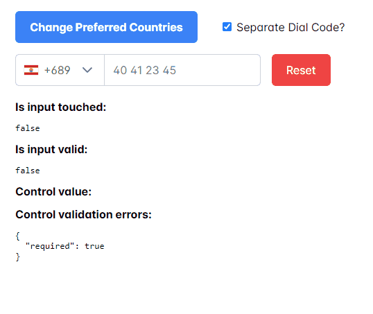

# International Telephone Input for Angular (PIntlInputTel)

[](https://travis-ci.org/jlevot/p-intl-input-tel) [](https://badge.fury.io/js/p-intl-input-tel-intl) [](https://www.npmjs.com/package/p-intl-input-tel-intl)

An Angular package for entering and validating international telephone numbers. It adds a flag dropdown to any input, detects the user's country, displays a relevant placeholder and provides formatting/validation methods.



**Compatibility:**

Validation with [google-libphonenumber](https://github.com/ruimarinho/google-libphonenumber)

| p-intl-input-tel | Angular | PrimeNG     |
|------------------|---------|-------------|
| 16.x.x           | 16.x.x  | \>= 16.8.0  |
| 17.x.x           | 17.x.x  | \>= 17.2.0  |
| 18.x.x           | 18.x.x  | \>= 17.18.0 |

## Installation

### Install Dependencies

`$ npm install p-intl-input-tel --save`

`$ npm install google-libphonenumber --save`

`$ npm install primeng`

### Add Dependency Style

to **angular.json** styles array:

```json

"styles": [
"./node_modules/p-intl-input-tel/src/assets/style.scss"
],
```

### Install This Library

`$ npm install p-intl-input-tel --save`

## Usage

### Import

Add `IntlInputTelComponent` to your standalone component:

```javascript
imports: [IntlInputTelComponent];
```

You can use it by this way:

```html

<form #f="ngForm" [formGroup]="phoneForm">
    <p-intl-tel-input
            [favoriteCountries]="favoriteCountries"
            [enableAutoCountrySelect]="true"
            [displayPlaceholder]="true"
            [selectedCountryISO]="CountryISO.FrenchPolynesia"
            [phoneValidation]="true"
            [separateDialCode]="separateDialCode"
            [numberFormat]="PhoneNumberFormat.INTERNATIONAL"
            [searchCountryField]="[SearchCountryField.NAME, SearchCountryField.DIALCODE]"
            cssClass="custom"
            [formControl]="phone">
    </p-intl-tel-input>
</form>
```

You can choose to use a formControl or just a formControlName. It depends on your needs.

## Options

| Options                  | Type                    | Default                           | Description                                                                                                   |
|--------------------------|-------------------------|-----------------------------------|---------------------------------------------------------------------------------------------------------------|
| cssClass                 | `string`                | `control-form`                    | Css class or your own custom one.                                                                             |
| favoriteCountries        | `<CountryISO>[]`        | `[]`                              | List of countries, which will appear at the top.                                                              |
| onlyCountries            | `<CountryISO>[]`        | `[]`                              | List of manually selected countries, which will appear in the dropdown.                                       |
| enableAutoCountrySelect  | `boolean`               | `true`                            | Toggle automatic country (flag) selection based on user input.                                                |
| displayPlaceholder       | `boolean`               | `true`                            | Input placeholder text, which adapts to the country selected.                                                 |
| customPlaceholder        | `string`                | `None`                            | Custom string to be inserted as a placeholder.                                                                |
| numberFormat             | `<PhoneNumberFormat>`   | `PhoneNumberFormat.International` | Custom string to be inserted as a placeholder.                                                                |
| displaySearchCountry     | `boolean`               | `false`                           | Enables input search box for countries in the flag dropdown.                                                  |
| searchCountryField       | `<SearchCountryField> ` | `SearchCountryField.All`          | Customize which fields to search in, if `searchCountryFlag` is enabled. Use `SearchCountryField` helper enum. |
| searchCountryPlaceholder | `string`                | `'Search Country'`                | Placeholder value for `searchCountryField`                                                                    |
| maxLength                | `number`                | `None`                            | Add character limit.                                                                                          |
| selectFirstCountry       | `boolean`               | `true`                            | Selects first country from `preferredCountries` if is set. If not then uses main list.                        |
| phoneValidation          | `boolean`               | `true`                            | Disable phone validation.                                                                                     |
| inputId                  | `string`                | `phone`                           | Unique ID for `<input>` element.                                                                              |
| selectedCountryISO       | `<CountryISO>`          | `None`                            | Set specific country on load.                                                                                 |
| separateDialCode         | `boolean`               | `false`                           | Visually separate dialcode into the drop down element.                                                        |
| countryChange            | `<Country>`             | `None`                            | Emits country value when the user selects a country from the dropdown.                                        |
| lang                     | `<Country>`             | `fr`                              | Language used for country name display and search.                                                            |

## Supported Formats

Following formats are supported

- NATIONAL // Produces "044 668 18 00"
- INTERNATIONAL // Produces "+41 44 668 18 00"
- E164 // Produces "+41446681800"
